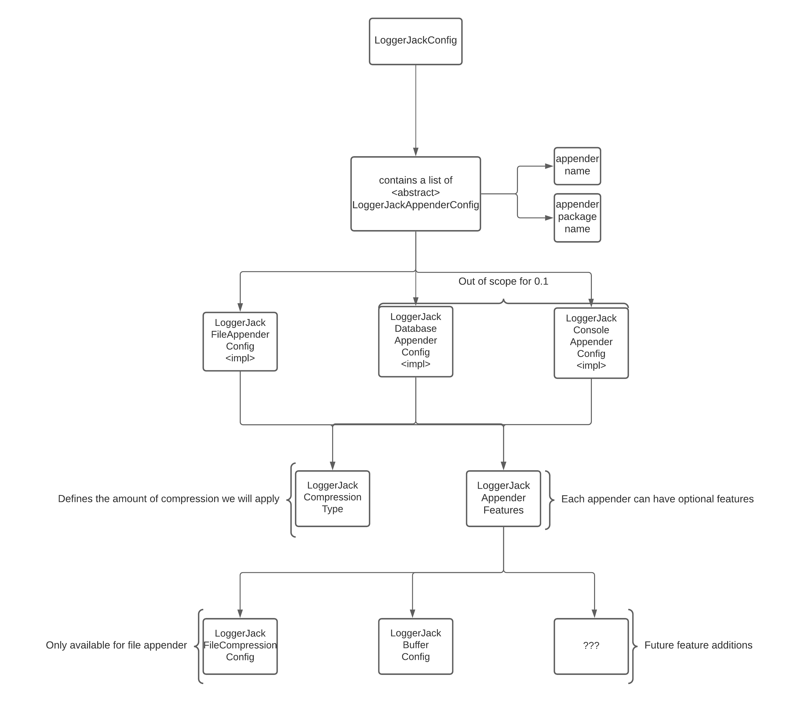

# LoggerJack configuration (v0.1)

## Overview and example

The idea is to have one simple configuration file for the whole logging framework.  
The format is not yet decided but most probably it will be in YAML.  

Users need to be able to define multiple LoggerJack appenders for different packages and features for those appenders.  
Currently, the feature set would be quite small (v0.1), like zipping mechanism for log file or buffering, we will elaborate on this later on.

An example LoggerJack configuration would look something like this:

```
 loggerjack-appenders:
   buffer-file:
     name: buffer-file
     package-name: com.f4k0.loggerjack.test
     compression-type: full
     type: file
     file-pattern: "application-log-[date]"
     line-pattern: "[level] [date] [timestamp] [thread] [class] [msg]"
     features:
       buffer:
         type: size
         buffer-size-limit: 1MB
```

Let's analyze the above example.  
- We want an appender for the `com.f4k0.loggerjack.test` package, which means everytime we get a logger for a class inside
this package it will be using this configuration.
- The appender will be a `file` type which means the output will be logged into a file using our binary logging
- The compression type is defined as `full` so we will make the file as small as possible by using variables etc.
- The file pattern is defined as `application-log-[date]` so the file will be something like `application-log-2021-07-01.dat`
- There is one feature added to this appender which is a `buffer`. The buffer has a size limit of 1MB so we will empty the buffer into the file when it reaches 1MB (features will be described in a different document in more depth)

## Implementation



Let's analyze this diagram.  
First we need to realize that the YAML will be translated into classes, and we will create our appenders according to those.  
We should have one main class that collects all the appender configurations.

The appenders should have one common abstract class that includes the common properties like name and package name.  
For now (v0.1) we will only talk about the File appender. In addition to the common properties the file appender config
will have some  important properties like file pattern and line pattern etc.  

Each appender can have multiple features, as seen on the diagram and every appender will have a property that defines how 
much compression we want to apply. Some users may want to have small amount, so the config is still human-readable.

The features will have their own config as well. They won't have a common base class because they don't have anything in common.

